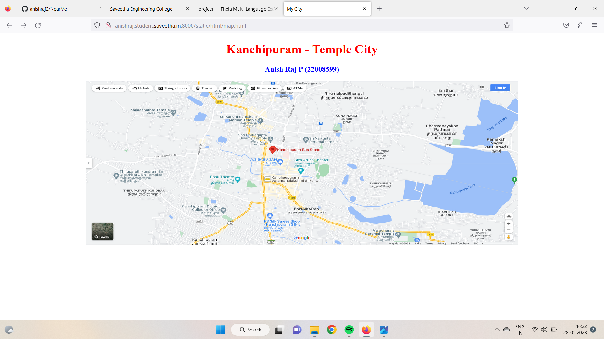
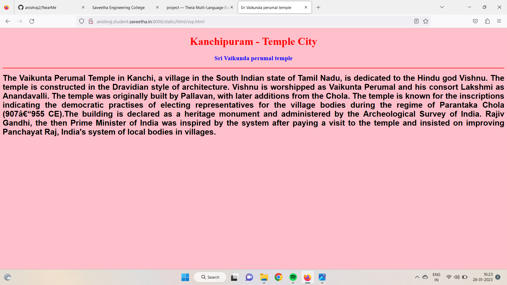
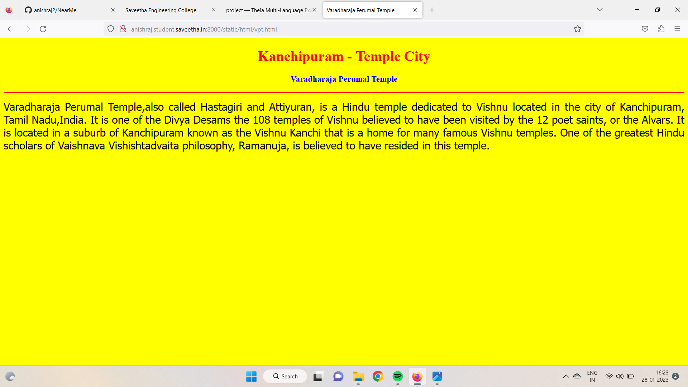
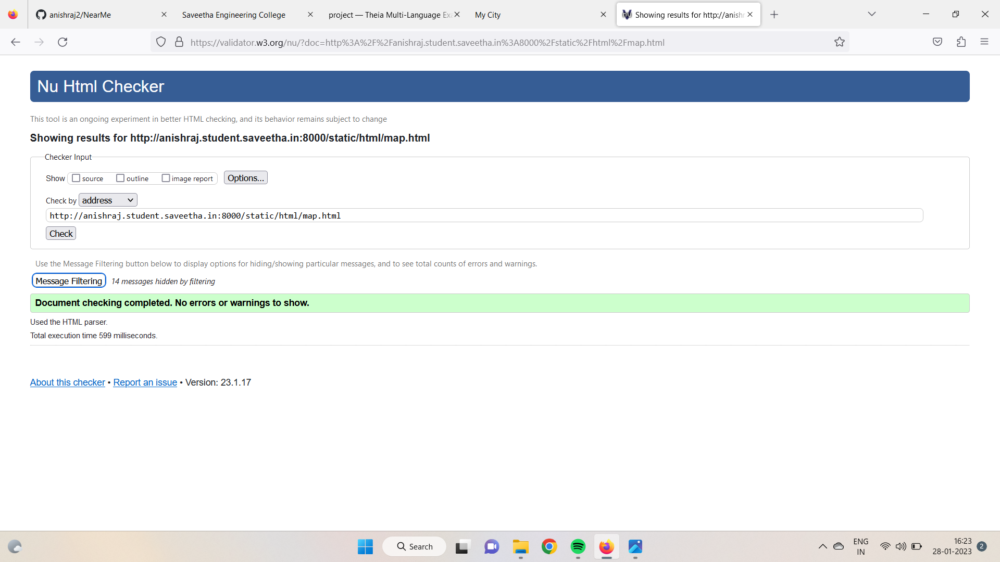

# Places Around Me
## AIM:
To develop a website to display details about the places around my house.

## Design Steps:

### Step 1:
Clone the git repository into Theia IDE.

### Step 2:
create a new Django project

### Step 3:
Write the needed HTML code.

### Step 4:
Run the Django server and execute the HTML files.

## Code:
```
map.html
<!DOCTYPE html>
<html lang="en">
<head>
<title>My City</title>
</head>
<body>
<h1 align="center">
<font color="red"><b>Kanchipuram - Temple City</b></font>
</h1>
<h3 align="center">
<font color="blue"><b>Anish Raj P (22008599)</b></font>
</h3>
<center>

<map name="MyCity">
<area shape="circle" coords="190,50,20" href="/static/html/kco.html" title="Kanchipuram District Collector Office">
<area shape="rectangle" coords="230,30,260,60" href="/static/html/svp.html" title="Sri Vaikunda perumal temple">
<area shape="circle" coords="400,350,50" href="/static/html/kat.html" title="Kamakshi Amman Temple">
<area shape="circle" coords="400,200,75" href="/static/html/bus.html" title="Hi-Tech Bus Stand">
<area shape="rectangle" coords="490,150,870,320" href="/static/html/vpt.html" title="Varadharaja Perumal Temple">
</map>
</center>
</body>
</html>

bus.html
<!DOCTYPE html>
<html lang="en">
<head>
<title>Bus Stand</title>
</head>
<body bgcolor="cyan">
<h1 align="center">
<font color="red"><b>Kanchipuram - Temple City</b></font>
</h1>
<h3 align="center">
<font color="blue"><b>Hi-Tech Bus Stand</b></font>
</h3>
<hr size="3" color="red">
<p align="justify">
<font face="Courier New" size="5">
<b>
Kanchipuram  also known as Conjeevaram, is a city in the Indian state of Tamil Nadu in the
 Tondaimandalam region, 72 km from Chennai – the capital of Tamil Nadu. Known as the City of
 Thousand Temples, Kanchipuram is known for its temple architectures, 1000-pillared halls, huge 
temple towers and silk saris. Kanchipuram serves as one of the most important tourist destinations in
 India. Kanchipuram has become a centre of attraction to the foreign tourists as well. The city covers 
an area of 36.14 kmsq  and an estimated population of more than 300,000 in 2021. It is the 
administrative headquarters of Kanchipuram District. Kanchipuram is well-connected by road and 
rail. 
</b>
</font>
</p>
</body>
</html>

kat.html
<!DOCTYPE html>
<html lang="en">
<head>
<title>Kamakshi Amman Temple</title>
</head>
<body bgcolor="orange">
<h1 align="center">
<font color="red"><b>Kanchipuram - Temple City</b></font>
</h1>
<h3 align="center">
<font color="blue"><b>Kamakshi Amman Temple</b></font>
</h3>
<hr size="3" color="red">
<p align="justify">
<font face="Georgia" size="5">
The Kamakshi Amman Temple 
<ol type="1">
<li> It is an ancient Hindu Temple.</li>
<li>It is dedicated to the goddess Kamakshi.</li>
<li> It is located in the historic city of Kanchipuram, near Chennai, India.</li>
<li>constructed to be credited to the Pallava kings..</li>
</ol>
</font>
</p>
</body>
</html>

kco.html
<!DOCTYPE html>
<html lang="en">
<head>
<title>Kanchipuram District Collector Office</title>
</head>
<body bgcolor="lime">
<h1 align="center">
<font color="red"><b>Kanchipuram - Temple City</b></font>
</h1>
<h3 align="center">
<font color="blue"><b>Kanchipuram District Collector Office</b></font>
</h3>
<hr size="3" color="red">
<p align="justify">
<font face="Georgia" size="5">
About Kancheepuram district 
<ul>
<li>It is situated on the northern East Coast of Tamil Nadu and is adjacent by  Chennai city and is bounded in the east by Chengalpattu District, west by Vellore District , south by  Thiruvannamalai district, in the north by Thiruvallur district and Chennai district</li>
<li>The district has a total geographical area of 1704.79 Sq.Kms .</li>
<li>Kancheepuram, the temple town is the district headquarters</li>
<li> For development reasons, it is divided into 5 development blocks with 274 Village Panchayats..</li>
</ul>
</font>
</p>
</body>
</html>

svp.html
<!DOCTYPE html>
<html lang="en">
<head>
<title>Sri Vaikunda perumal temple</title>
</head>
<body bgcolor="pink">
<h1 align="center">
<font color="red"><b>Kanchipuram - Temple City</b></font>
</h1>
<h3 align="center">
<font color="blue"><b>Sri Vaikunda perumal temple</b></font>
</h3>
<hr size="3" color="red">
<p align="justify">
<font face="Arial" size="5">
<b>
The Vaikunta Perumal Temple in Kanchi, a village in the South Indian state of Tamil Nadu, is dedicated to the Hindu god Vishnu. The temple is constructed in the Dravidian style of architecture. Vishnu is worshipped as Vaikunta Perumal and his consort Lakshmi as Anandavalli. The temple was originally built by Pallavan, with later additions from the Chola. The temple is known for the inscriptions indicating the democratic practises of electing representatives for the village bodies during the regime of Parantaka Chola (907–955 CE).The building is declared as a heritage monument and administered by the Archeological Survey of India. Rajiv Gandhi, the then Prime Minister of India was inspired by the system after paying a visit to the temple and insisted on improving Panchayat Raj, India's system of local bodies in villages.
</b>
</font>
</p>
</body>
</html>

vpt.html
<!DOCTYPE html>
<html lang="en">
<head>
<title>Varadharaja Perumal Temple</title>
</head>
<body bgcolor="yellow">
<h1 align="center">
<font color="red"><b>Kanchipuram - Temple City</b></font>
</h1>
<h3 align="center">
<font color="blue"><b>Varadharaja Perumal Temple</b></font>
</h3>
<hr size="3" color="red">
<p align="justify">
<font face="Tahoma" size="5">
Varadharaja Perumal Temple,also called Hastagiri and Attiyuran, is a Hindu temple dedicated to
 Vishnu located in the city of Kanchipuram, Tamil Nadu,India. It is one of the Divya Desams the 108 
temples of Vishnu believed to have been visited by the 12 poet saints, or the Alvars. It is located in a 
suburb of Kanchipuram known as the Vishnu Kanchi that is a home for many famous Vishnu temples. 
One of the greatest Hindu scholars of Vaishnava Vishishtadvaita philosophy, Ramanuja, is believed to
 have resided in this temple.
</font>
</p>
</body>
</html>

```
## Output:








## HTML Validator:


## Result:
The program for implementing image map is executed successfully